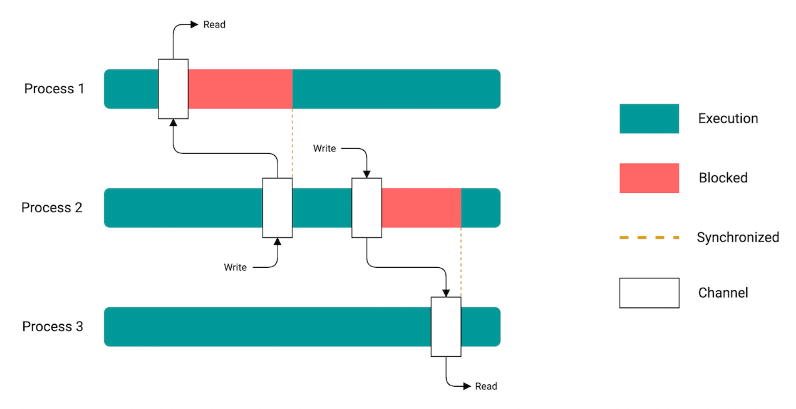
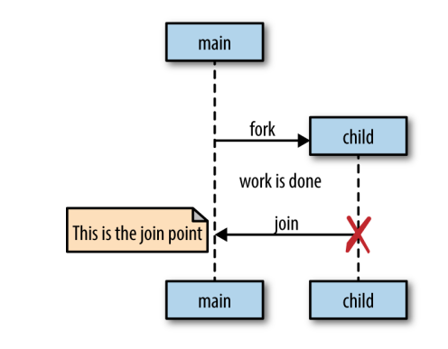

Go语言并发编程

.. title:: Go语言并发编程

* `并发面临的问题`_
    * `竞争条件`_
    * `原子性`_
    * `共享内存`_
    * `死锁、活锁、饥饿`_
* `Go语言并发`_
    * `并发和并行`_
    * `CSP模型`_
* `基础设施`_
    * `协程`_
    * `WaitGroup`_
    * `互斥锁`_
    * `条件变量`_
    * `Once`_
    * `对象池`_
    * `通道`_
    * `Select`_
    * `GOMAXPROCS`_
* `并发模式`_
    * `并发安全的数据`_
    * `For-select模式`_
    * `防止协程泄露`_
    * `Or通道`_
    * `错误处理`_
    * `处理管线`_
    * `分发和聚合`_
    * `orDone通道`_
    * `tee通道`_
    * `bridge通道`_
    * `缓冲通道`_
    * `context`_
* `大规模并发`_
    * `错误传递`_
    * `超时机制`_
    * `心跳脉冲`_
    * `流量限制`_
    * `协程恢复`_
* `并发运行时`_
* `附录`_

并发面临的问题
==============

* `竞争条件`_
* `原子性`_
* `共享内存`_
* `死锁、活锁、饥饿`_

竞争条件
--------

竞争条件（race condition）是并发程序中自然出现的一个问题。只要涉及对同一个共享资源
的访问，势必会造成多个CPU对同一个资源使用权的争夺，为了保证逻辑正确性，必须保证一种
访问顺序，使得相互影响的逻辑能够互不干扰的执行。如果这种顺序得不到保障，就会出现竞争
条件，多个CPU按胡乱的顺序同时对同一个资源瞎涂乱改，程序最后的运行结果只有一团糟。

由于多个CPU按哪种顺序执行是完全不可预知的，因此竞争条件的问题一旦存在，程序的结果可能
同样完全不可预知。更坏的是，程序可能在大多数时间里正常执行，只在极端的小概率情况下出现
问题。这也就是竞争条件问题非常棘手的原因。

一个条件竞争的例子： ::

    type Account struct {
        Balance int
    }
    func (a *Account) Withdraw(n int) error {
        if a.Balance < n {
            return ErrInsufficient
        }
        a.Balance -= n
        return nil
    }
    a := Account{Balance:10}
    go func() {a.Withdraw(6)}() // 协程1
    go func() {a.Withdraw(5)}() // 协程2

按照正常的逻辑，根据协程1和协程2谁先执行，最后共享变量Balance的值应该是4或者5，并且
只有一个协程执行成功。但是程序可能产生错误的结果： ::

    协程1：读取10
    协程2：读取10
    协程2：写入5返回成功
    协程1：写入-1返回成功

很明显，错误的原因是CPU并没有按你预想的顺序执行。在编写并发代码时，有时候你可能绞尽
脑汁在想各种可能的情况，但除非使用了正确的某种机制，实际上最后也无法保证程序的正确性，
即使程序看起来执行成功了，但隐藏的问题一直存在。

总之，没有正确机制的保障，一个CPU总是无法正确看到一个可以同时被其他CPU修改的变量的值。
因此，当涉及读取——决策——更新操作时，都常常会引起竞争条件问题。

原子性
-------

原子性，即不可分割，具有原子性的事物是一个完整的不可再分的整体。在并发程序中，一些
操作必须原子地执行，才能保证代码的正确性。例如上面的例子，Withdraw函数中的代码必须
作为整体原子地执行，才能保证一个CPU在执行过程中，不会被另一个CPU篡改，从而保证这个
函数的逻辑正确性。

另外，Go语言保证对于小于等于机器字长（int类型的长度）的变量的写操作是原子的，但这并
不保证另一个协程可以看到这个写操作的效果。这句话有两个意思。第一个意思是，对于小于
等于机器字长的共享变量，一个协程写这个变量的同时另一个协程读，读到的结果保证是这个
变量写之前的值或者写之后的值。当然如果变量的长度超过机器字长，那么结果可能是任何值，
因为多个CPU按任何顺序操作这个变量都是可能的。

第二个意思是，编译器为了优化代码可能调整代码的顺序，操作系统也可能乱序执行内存操作
指令，另一个协程可能在预期的时间内不能看到这个写操作的效果。

看下面的例子，done和a都是小于等于机器字长的变量，因此主协程读到的done的值只会是false
或者true，读到的a的值只会是0或者1。 ::

    func main() {
        var done bool
        var a int
        go func() {
            a = 1
            done = true
        }()
        for !done {
        }
        fmt.Println(a)
    }

由于使用了for循环一直在读取done的值，直到为true退出，然后打印a的值。但是打印的a的值
一定是1吗？不一定，也可能是0。因为 ``a=1`` 可能在 ``done=true`` 之后执行。可以用
Go语言提供的原子操作保证代码的顺序，例如： ::

    func main() {
        var done atomic.Bool
        var a int
        go func() {
            a = 1
            done.Store(true)
        }()
        if done.Load() { // 这里要么打印1要么不打印，即只要读到done是true，a一定是1
            fmt.Println(a)
        }
    }

另外，Go语言也提供了CAS原子操作（compare-and-swap），该操作等价于原子的执行： ::

    if variable == testValue { // 相当于安全的在等于testValue的条件下改成newValue
        variable = newValue    // 如果不原子执行，变量可能在该条件成立的情况下又立马被另一协程改了
        return true
    } else {
        return false
    }

共享内存
---------

在共享内存模型中，并行执行的多个线程可以同时访问相同的内存，例如同一个变量。同时访问
同一个变量，意味着多个CPU都在按自己的指令逻辑，同时操作这个变量，显而易见一个变量不能
同时反应两个逻辑，这个变量的含义就被破坏了。因此在并行的场景下，我们必须提供某种保证
顺序的机制，来保证代码逻辑的正确性。例如访问共享变量，至少要保证执行改变该变量逻辑的
指令时，当该逻辑完全反映到这个变量上之前，需要禁止其他CPU执行自己的逻辑。

其中内存屏障（memory barrier）是一种低层次的顺序机制，它只是一个指令，保证一个CPU在
执行完这个指令之后，它前面执行的逻辑都已经正确反应到内存的变量中去了。但在逻辑复杂的
情况下，内存屏障还不够，因为它没有阻止其他CPU同时执行自己的逻辑。

这里引出更高层次的顺序机制，称为临界区（critical section）。我们将一段对共享资源进行
操作的代码逻辑封装在一个临界区中，使用锁进行保护，当一个CPU执行这段逻辑时，其他CPU都
必须等待。相当于临界区代码的执行是原子的，一个CPU要么不执行，要么全部执行完。

因此在共享内存模型中，要使程序的代码逻辑正确，必须保证某种顺序，它是通过上面的同步机制
保证的。还有一种并发模型，称为消息传递模型。在消息传统模型中，这种顺序是通过消息传递来
保证的，也即在接收方接收到消息的时间点，发送方对应的操作已经确定完成了。

Go语言同时支持这两种并发模型，其中共享内存模型通过sync代码包中的原子操作、以及锁来
实现。而消息传递模型，通过Go提供的协程（goroutine）和通道（channel）来实现。Go语言
的设计借鉴了CSP中的概念，多个隔离的进程（即协程）之间使用收发数据也即消息（对应的是
对通道的读写操作）来实现同步。

注意，在程序中我们常常使用print或类似的函数打印程序状态，特别是在结果不预期的条件
中记录当前信息。但这些打印或者输出函数，常常调用了锁或者原子操作函数，会影响并发程序
的时序。并发程序常常是时序敏感的，可能刚好是这些打印掩盖了代码中潜在的问题，导致问题
没有及时发现，当部署到实际环境中才暴露出来。

死锁、活锁、饥饿
----------------

并发程序的经典问题：死锁、活锁、饥饿。一个可能死锁的例子： ::

    type value struct {
        mu sync.Mutex
        value int
    }
    var wg sync.WaitGroup
    printSum := func(v1, v2 *value) {
        defer wg.Done()
        v1.mu.Lock()
        defer v1.mu.Unlock()
        time.Sleep(2*time.Second)
        v2.mu.Lock()
        defer v2.mu.Unlock()
        fmt.Printf("sum=%v\n", v1.value + v2.value)
    }
    var a, b value
    wg.Add(2)
    go printSum(&a, &b) // 可能锁了a，但去锁b时获取不到b的锁，相互锁死
    go printSum(&b, &a) // 可能锁了b，但去锁a时获取不到a的锁，相互锁死
    wg.Wait()

死锁一定满足下面四个科夫曼条件（coffman conditions），只要一个不成立，
死锁就不会发生：

- 互斥条件（mutual exclusion）
      一个资源只能被一个并发进程独占使用，或完全空闲
- 占有等待条件（wait for condition）
      当一个并发进程等其他资源时，同时占有当前资源不放
- 不抢占条件（no preemption）
      一个并发进程独占的资源在未使用完之前，不能被其他进程夺走只能由当前进行主动释放
- 循环等待（circular wait）
      在资源等待链中，存在进程P1正在等待P2占有的资源，同时P2也在等待P1占有的资源

以上代码完美满足这四个条件，确定存在死锁。这些条件也可以用来避免死锁的发生，只要
打破一个条件，就可以避免死锁问题。但在实际代码中，这些条件很难被明显的指正出来，
导致很难完全避免死锁。

活锁（livelock）：所有的进程都在干活，但实际程序没有任何进展。可以想象两个人相遇
在同一条道路上，一个人想往右边走的同时，另一个人也往同一个方向走，导致两人谁也让
不了谁，然后一直两人都无法通过。一个活锁的例子::

    cadence := sync.NewCond(&sync.Mutex{})
    go func() {
        for range time.Tick(1*time.Millisecond) {
            cadence.Broadcast()
        }
    }()
    takeStep := func() {
        cadence.L.Lock()
        cadence.Wait()
        cadence.L.Unlock()
    }
    tryDir := func(dirName string, dir *int32, out *bytes.Buffer) bool {
        fmt.Fprintf(out, " %v", dirName)
        atomic.AddInt32(dir, 1)
        takeStep()
        if atomic.LoadInt32(dir) == 1 {
            fmt.Fprint(out, ". Success!")
            return true
        }
        takeStep()
        atomic.AddInt32(dir, -1)
        return false
    }
    var left, right int32
    tryLeft := func(out *bytes.Buffer) bool { return tryDir("left", &left, out) }
    tryRight := func(out *bytes.Buffer) bool { return tryDir("right", &right, out) }
    walk := func(walking *sync.WaitGroup, name string) {
        var out bytes.Buffer
        defer func() { fmt.Println(out.string()) }()
        defer walking.Done()
        fmt.Fprintf(&out, "%v is trying to scoot:", name)
        for i := 0; i < 5; i++ {
            if tryLeft(&out) || tryRight(&out) { // 这里两个人都会同时往左移或者往右移
                return
            }
        }
        fmt.Fprintf(&out, "\n%v tosses her hands up in exasperation!", name)
    }
    var peopleInHallway sync.WaitGroup
    peopleInHallway.Add(2)
    go walk(&peopleInHallway, "Alice")
    go walk(&peopleInHallway, "Barbara")
    peopleInHallway.Wait()

活锁是另一大类问题（饥饿问题）中的一种，但它更强调的是所有操作都在公平的挨饿，没有
任何操作有进展。而饥饿问题表示的是，需要进行的操作没有被公平的对待，存在一些操作没
有有效处理、或长期处于未处理状态、或根本没处理。一个饥饿问题的例子： ::

    var wg sync.WaitGroup
    var sharedLock sync.Mutex
    const runtime = 1*time.Second
    greedyWorker := func() {
        defer wg.Done()
        var count int
        for begin := time.Now(); time.Since(begin) <= runtime; {
            sharedLock.Lock()
            time.Sleep(3*time.Nanosecond) // 每次执行3纳秒
            sharedLock.Unlock()
            count++
        }
        fmt.Printf("Greedy worker was able to execute %v work loops\n", count)
    }
    politeWorker := func() {
        defer wg.Done()
        var count int
        for begin := time.Now(); time.Since(begin) <= runtime; {
            sharedLock.Lock()
            time.Sleep(1*time.Nanosecond) // 每次执行1纳秒
            sharedLock.Unlock()
            sharedLock.Lock()
            time.Sleep(1*time.Nanosecond)
            sharedLock.Unlock()
            sharedLock.Lock()
            time.Sleep(1*time.Nanosecond)
            sharedLock.Unlock()
            count++
        }
        fmt.Printf("Polite worker was able to execute %v work loops.\n", count)
    }
    wg.Add(2)
    go greedyWorker()
    go politeWorker()
    wg.Wait()

Go语言并发
===========

* `并发和并行`_
* `CSP模型`_

并发和并行
----------

并发（concurrency）与并行执行（parallelism）的区别：并发是代码的属性，
并行执行是程序的运行时属性。并发的代码，可能在实际运行时并不是并行执行
的，例如在单核机器上。虽然在单核机器上，两个并发的代码可能仍然被映射到
两个线程上，但这两个线程并没有真正并行执行，只是在一个CPU中做着顺序的
时间片轮换。

Go语言引入协程（goroutine）是为了简化并发程序的组织方式，并且最大限度
发挥多核处理器的性能。利用协程，开发人员可以直接面对问题编程，不再需要
考虑各种并发程序的繁琐细节，只要理解Go提供的并发基础设施的基本原理，就
可以快捷方便的编程，而且还不易于出错。

对于那些繁琐的底层细节，都交给Go运行时来保证就好了。而且由于协程是由
运行时掌控的，运行时会知晓每个协程的阻塞点和唤醒点，这样运行时就可以
高效地调度活动的协程给线程执行，最大限度地保证线程繁忙不空闲。具体见
`并发运行时`_ 部分。

而通道（channel）不但可以传输数据，而且是一种同步工具。它的理念是尽
最大的可能不去共享内存，从而避免共享内存带来的各种同步问题，以及运行
时开销。实际上，由Go语言的设计保证，在通道中发送的数据，在同一时间只
会被一个协程访问，从而避免了数据竞争问题。因此，Go语言鼓励使用通道在
两个协程之间传递数据的引用。

可以想象，就像是单CPU上执行单线程程序一样不需要同步；再增加一个单CPU
执行的程序也不需要同步；然后让这两个独立CPU上执行的程序进行通信，如果
通信本身就是同步的，仍然不需要额外的同步。

CSP模型
--------

Go语言的协程和通道是基于 C. A. R. Hoare 的 CSP（communicating sequential
processes）模型设计的：

为了在两个进程中通信（其中进程表示任何需要输入并产生输出的逻辑块），Hoare
创建了输入和输出命令：!用来将输入数据发送到进程，?用来读取一个进程的输出。
例如： ::

    cardreader?cardimage     从cardreader进程读取输出保存到变量cardimage中
    lineprinter!lineimage    将数据lineimage作为输入发送到进程lineprinter
    X?(x, y)                 从X进程读取一对数据，保存到变量x和y中
    DIV!(3*a+b, 13)          将两个数据作为输入发送到进程DIV
    *[c:character; west?c → east!c] 读取west进程所有的输出字符，并依次发送给east进程，直到west进程终止循环结束

CSP的这几种操作，也基本对应了Go通道所支持的操作。

除了协程和通道，Go语言还在sync程序包中提供了传统的共享内存式的同步访问机制。
虽然提供了这些操作，在面对具体问题时，首先应该考虑是否可以使用通道来实现。但
总的原则，要看哪种模型更简单、更易于表达。

基础设施
=========

* `协程`_
* `WaitGroup`_
* `互斥锁`_
* `条件变量`_
* `Once`_
* `对象池`_
* `通道`_
* `Select`_
* `GOMAXPROCS`_

并发编程的基础设施包括：协程、通道、select语句，以及sync包中的WaitGroup、
Mutex、RWMutex、Cond、Once、Pool等等。

协程
-----

协程（goroutine）是Go语言最基本的基础设施。一个Go语言程序至少有两个协程，
即主协程（main goroutine）和垃圾回收协程。

在函数调用之前添加go关键字启动新协程： ::

    func main() {
        go sayHello()
        go func() {
            fmt.Println("hello")
        }()
        sayHello := func() {
            fmt.Println("hello")
        }
        go sayHello()
    }
    func sayHello() {
        fmt.Println("hello")
    }

协程与线程不同，协程是非抢占式的，它们不会被外部中断（但可能被运行时中断），它们
需要在合适的时机主动让出CPU。协程可以在代码中的特定点挂起（suspension）暂停执行，
然后再重新进入（reentry）恢复执行，这些点通常是I/O操作或者通道操作。

协程与运行时进行了深度绑定，协程不需要定义自己的挂起和恢复点，Go运行时会自动察觉
协程的运行时行为，当它们阻塞的时候自动挂起，当它们不阻塞的时候自动恢复。相当于只有
在协程阻塞的时候，它们才会让出自己的CPU。但是如果一个协程是真的被阻塞住了（例如
调用了阻塞式的系统调用），运行时会自动分配一个新的活动的线程出来，分担协程的执行
任务，保证活动的系统线程数量总是维持不变。

协程是轻量级的，它们除了栈的内存之外几乎没有其他开销，而占据栈的空间大小大概是几KB
字节。为了保持栈的小巧，Go运行时使用可调整大小、有界限的栈。一个新创建的协程被赋予
几KB的空间，这几乎总是足够的。当不够用时，运行时会自动增加（和减少）栈的存储空间，
以允许更多的协程在适度的内存空间中生存。而CPU的开销平均大约是每个函数调用三个廉价
指令的开销。在实际环境中，相同的地址空间内创建几十万个协程没有问题。

Go的并发遵循fork-join模型，一个协程在其代码的任何位置，都可以作为父协程通过go关键字
fork出子协程。这些fork的所有子协程分支，会在它们执行完毕后，在其对应的join点聚合到
父协程。

一个协程不会自动等待子协程执行完毕，需要使用sync代码包中的WaitGroup，或者使用通道，
否则子协程可能还没来得及执行父协程就退出了： ::

    var wg sync.WaitGroup
    sayHello := func() {
        defer wg.Done()
        fmt.Println("hello")
    }
    wg.Add(1)
    go sayHello()
    wg.wait() // join point

匿名函数其实是创建一个闭包，它可以使用当前函数声明的变量，这些变量共享在当前函数和
闭包中。因此在闭包中访问外部变量不是拷贝这个变量，而是对这个变量的引用。如果闭包
在新的协程中执行，要考虑多协程访问的同步问题，或者通过函数参数对变量进行拷贝。闭包
定义时引用的外部变量，可能在闭包执行时（不管是在协程中执行还是保存以后执行）它引用
的变量可能已经超出生存期了，例如下面的salutation变量，这时Go运行时会自动延长对应
变量的生命期，例如将变量从栈中移到堆中以保证变量在闭包执行过程中总是有效的。 ::

    var wg sync.WaitGroup
    for _, salutation := range []string{"hello", "greetings", "good day"} {
        wg.Add(1)
        go func() {
            defer wg.Done()
            fmt.Println(salutation)
        }()
    }
    wg.Wait()

可以使用函数参数避免对外部变量的引用： ::

    var wg sync.WaitGroup
    for _, salutation := range []string{"hello", "greetings", "good day"} {
        wg.Add(1)
        go func(salutation string) {
            defer wg.Done()
            fmt.Println(salutation)
        }(salutation)
    }
    wg.Wait()

以下代码可以用来统计协程默认状态下的实际大小（大概2.5KB左右）： ::

    memConsumed := func() uint64 {
        runtime.GC()
        var s runtime.MemStats
        runtime.ReadMemStats(&s)
        return s.Sys
    }
    var c <-chan interface{}
    var wg sync.WaitGroup
    noop := func() { wg.Done(); <-c }
    const numGoroutines = 1e4
    wg.Add(numGoroutines)
    before := memConsumed()
    for i := numGoroutines; i > 0; i-- {
        go noop()
    }
    wg.Wait()
    after := memConsumed()
    fmt.Printf("%.3fKB", float64(after-before)/numGoroutines/1024)

以下代码用来检测两个协程大概的切换时间（大约225ns）： ::

    func BenchmarkContextSwitch(b *testing.B) {
        var wg sync.WaitGroup
        begin := make(chan struct{})
        c := make(chan struct{})
        var token struct{}
        sender := func() {
            defer wg.Done()
            <-begin
            for i := 0; i < b.N; i++ {
                c <- token
            }
        }
        receiver := func() {
            defer wg.Done()
            <-begin
            for i := 0; i < b.N; i++ {
                <-c
            }
        }
        wg.Add(2)
        go sender()
        go receiver()
        b.StartTimer()
        close(begin)
        wg.Wait()
    }

    go test -bench=. -cpu=1 context_switch_test.go

WaitGroup
----------

WaitGroup可以用来等待一系列协程的完成，当你不需要关心这些协程的结果，
或者有其他方法收集这些结果时。而如果想要收集协程的结果，推荐使用通道
和select语句。

下面是WaitGroup等待协程完成的例子： ::

    var wg sync.WaitGroup
    wg.Add(1)
    go func() {
        defer wg.Done()
        fmt.Println("1st goroutine sleeping...")
        time.Sleep(1)
    }()
    wg.Add(1)
    go func() {
        defer wg.Done()
        fmt.Println("2nd goroutine sleeping...")
        time.Sleep(2)
    }()
    wg.Wait()
    fmt.Println("All goroutines complete.")

    hello := func(wg *sync.WaitGroup, id int) {
        defer wg.Done()
        fmt.Printf("Hello from %v!\n", id)
    }
    const numGreeters = 5
    var wg sync.WaitGroup
    wg.Add(numGreeters)
    for i := 0; i < numGreeters; i++ {
        go hello(&wg, i+1)
    }
    wg.Wait()

互斥锁
-------

互斥锁的例子： ::

    var count int
    var lock sync.Mutex
    increment := func() {
        lock.Lock()
        defer lock.Unlock()
        count++
        fmt.Printf("Incrementing: %d\n", count)
    }
    decrement := func() {
        lock.Lock()
        defer lock.Unlock()
        count--
        fmt.Printf("Decrementing: %d\n", count)
    }
    // Increment
    var arithmetic sync.WaitGroup
    for i := 0; i <= 5; i++ {
        arithmetic.Add(1)
        go func() {
            defer arithmetic.Done()
            increment()
        }()
    }
    // Decrement
    for i := 0; i <= 5; i++ {
        arithmetic.Add(1)
        go func() {
            defer arithmetic.Done()
            decrement()
        }()
    }
    arithmetic.Wait()
    fmt.Println("Arithmetic complete.")

读写锁的例子，当读的协程比写的协程明显更多时可以使用： ::

    producer := func(wg *sync.WaitGroup, l sync.Locker) {
        defer wg.Done()
        for i := 5; i > 0; i-- {
            l.Lock()
            l.Unlock()
            time.Sleep(1)
        }
    }
    observer := func(wg *sync.WaitGroup, l sync.Locker) {
        defer wg.Done()
        l.Lock()
        defer l.Unlock()
    }
    test := func(count int, mutex, rwMutex sync.Locker) time.Duration {
        var wg sync.WaitGroup
        wg.Add(count+1)
        beginTestTime := time.Now()
        go producer(&wg, mutex)
        for i := count; i > 0; i-- {
            go observer(&wg, rwMutex)
        }
        wg.Wait()
        return time.Since(beginTestTime)
    }
    tw := tabwriter.NewWriter(os.Stdout, 0, 1, 2, ' ', 0)
    defer tw.Flush()
    var m sync.RWMutex
    fmt.Fprintf(tw, "Readers\tRWMutext\tMutex\n")
    for i := 0; i < 20; i++ {
        count := int(math.Pow(2, float64(i)))
        fmt.Fprintf(
            tw,
            "%d\t%v\t%v\n",
            count,
            test(count, &m, m.RLocker()),
            test(count, &m, &m),
        )
    }

条件变量
--------

条件变量用来同步地等待条件的成立，它的定义如下： ::

    type Locker interface {
        Lock()
        Unlock()
    }
    type cond struct {
        L Locker // a *Mutex or *RWMutex
        ...
    }
    func NewCond(l Locker) *Cond
    func (c *Cond) Broadcast() // 唤醒所有等待c的协程，允许但不需要调用协程持有锁c.L
    func (c *Cond) Signal()    // 唤醒一个正在等待c的协程（如果有），允许但不需要调用协程持有锁c.L
    func (c *Cond) Wait()      // 会自动unlock锁并挂起协程的执行，直到被Broadcast或Signal唤醒，会自动在返回之前lock锁

运行时会给每个条件变量维护一个等待该条件变量的协程的先进先出队列，Signal会唤醒
等待最长的那个协程，而Broadcast会唤醒所有等待的协程。

因为条件变量在等待时是没有加锁的，因此被唤醒后在返回之前可能有其他协程改变了条件，
因而主调函数必须在循环中调用Wait： ::

    c.L.Lock()
    for !condition() {
        c.Wait()
    }
    ... make use of condition ...
    c.L.Unlock()

一个条件变量的例子： ::

    c := sync.NewCond(&sync.Mutex{})
    queue := make([]interface{}, 0, 10)
    removeFromQueue := func(delay time.Duration) {
        time.Sleep(delay)
        c.L.Lock()
        queue = queue[1:]
        fmt.Println("Removed from queue")
        c.L.Unlock()
        c.Signal()
    }
    for i := 0; i < 10; i++{
        c.L.Lock()
        for len(queue) == 2 {
            c.Wait()
        }
        fmt.Println("Adding to queue")
        queue = append(queue, struct{}{})
        go removeFromQueue(1*time.Second)
        c.L.Unlock()
    }

使用Broadcast的例子： ::

    type Button struct {
        Clicked *sync.Cond
    }
    button := Button{ Clicked: sync.NewCond(&sync.Mutex{}) }
    subscribe := func(c *sync.Cond, fn func()) {
        var goroutineRunning sync.WaitGroup
        goroutineRunning.Add(1)
        go func() {
            goroutineRunning.Done()
            c.L.Lock()
            defer c.L.Unlock()
            c.Wait()
            fn()
        }()
        goroutineRunning.Wait()
    }
    var clickRegistered sync.WaitGroup
    clickRegistered.Add(3)
    subscribe(button.Clicked, func() {
            fmt.Println("Maximizing window.")
            clickRegistered.Done()
        })
    subscribe(button.Clicked, func() {
            fmt.Println("Displaying annoying dialog box!")
            clickRegistered.Done()
        })
    subscribe(button.Clicked, func() {
            fmt.Println("Mouse clicked.")
            clickRegistered.Done()
        })
    button.Clicked.Broadcast()
    clickRegistered.Wait()

Once
-----

Once类型保证Do函数只会被同步执行一次，例如： ::

    var count int
    increment := func() {
        count++
    }
    var once sync.Once
    var increments sync.WaitGroup
    increments.Add(100)
    for i := 0; i < 100; i++ {
        go func() {
            defer increments.Done()
            once.Do(increment)
        }()
    }
    increments.Wait()
    fmt.Printf("Count is %d\n", count)

注意Once计算的不是传入函数的执行次数，而是Do函数的执行次数，因此下面的打印的
结果是1： ::

    var count int
    increment := func() { count++ }
    decrement := func() { count-- }
    var once sync.Once
    once.Do(increment)
    once.Do(decrement)
    fmt.Printf("Count: %d\n", count)

下面的例子会造成死锁： ::

    var onceA, onceB sync.Once
    var initB func()
    initA := func() { onceB.Do(initB) }
    initB = func() { onceA.Do(initA) } // 这一行不会处理直到下面这一行完成
    onceA.Do(initA) // 这一行不会完成直到上一行完成处理

对象池
-------

对象池模式是一种创建固定数目对象来使用的方式，通常这种对象的创建是很昂贵的（例如
数据库连接），因此仅创建固定的数目，但是可以让很多人来共享使用这些对象。在Go语言中，
sync.Pool是一个可以被多协程安全访问的类型。 ::

    type Pool
    type Pool struct {
        New func() any // 如果提供了New会在Get返回nil时用来生成一个值
    }
    func (*Pool) Put(x any)
    func (*Pool) Get() any

函数Get从对象池中任选一个值返回，并将这个值从对象池中移除。如果Get的值为nil并且
p.New不是nil，会返回p.New()的结果。当获取的对象用完后，通常要调用Put函数将对象
还回到对象池中重用。 ::

    myPool := &sync.Pool{
        New: func() interface{} {
            fmt.Println("Creating new instance.")
            return struct{}{}
        },
    }
    instance := myPool.Get()
    myPool.Put(instance)

    var numCalcsCreated int
    calcPool := &sync.Pool {
        New: func() interface{} {
            numCalcsCreated += 1
            mem := make([]byte, 1024)
            return &mem
        },
    }
    // Seed the pool with 4KB
    calcPool.Put(calcPool.New())
    calcPool.Put(calcPool.New())
    calcPool.Put(calcPool.New())
    calcPool.Put(calcPool.New())
    const numWorkers = 1024*1024
    var wg sync.WaitGroup
    wg.Add(numWorkers)
    for i := numWorkers; i > 0; i-- {
        go func() {
            defer wg.Done()
            mem := calcPool.Get().(*[]byte)
            defer calcPool.Put(mem)
            // Assume something interesting, but quick is being done with
            // this memory.
        }()
    }
    wg.Wait()
    fmt.Printf("%d calculators were created.", numCalcsCreated)

使用Pool的一个好处是，可以提前创建好这些昂贵的对象以提升效率： ::

    func connectToService() interface{} {
        time.Sleep(1*time.Second)
        return struct{}{}
    }
    func warmServiceConnCache() *sync.Pool {
        p := &sync.Pool {
            New: connectToService,
        }
        for i := 0; i < 10; i++ {
            p.Put(p.New())
        }
        return p
    }
    func startNetworkDaemon() *sync.WaitGroup {
        var wg sync.WaitGroup
        wg.Add(1)
        go func() {
            connPool := warmServiceConnCache()
            server, err := net.Listen("tcp", "localhost:8080")
            if err != nil {
                log.Fatalf("cannot listen: %v", err)
            }
            defer server.Close()
            wg.Done()
            for {
                conn, err := server.Accept()
                if err != nil {
                    log.Printf("cannot accept connection: %v", err)
                    continue
                }
                svcConn := connPool.Get()
                fmt.Fprintln(conn, "")
                connPool.Put(svcConn)
                conn.Close()
            }
        }()
        return &wg
    }
    func init() {
        daemonStarted := startNetworkDaemon()
        daemonStarted.Wait()
    }
    func BenchmarkNetworkRequest(b *testing.B) {
        for i := 0; i < b.N; i++ {
            conn, err := net.Dial("tcp", "localhost:8080")
            if err != nil {
                b.Fatalf("cannot dial host: %v", err)
            }
            if _, err := ioutil.ReadAll(conn); err != nil {
                b.Fatalf("cannot read: %v", err)
            }
            conn.Close()
        }
    }

因此对象池的使用场景，要么是并发程序需要频繁创建和销毁对象，这时对象池可以减少
创建和销毁对象的开销，因为对象可以在使用后被回收重复利用，而不是每次都创建新的
实例；要么是对象的创建成本很高或初始化需要消耗大量资源，对象池可以预先创建一定
数量的对象，并在需要时提供给请求者使用，从而避免重复高成本的创建过程。

通道
-----

通道是Go语言提供的遵从CSP模式的并发基本元素。像一条河流一样，通道提供的是一条
信息流管道，值可以通过通道进行传输并且在下游进行读取。通道不仅可以传输数据，还
是一种同步工具。

通道有发送和接收方向之分，单方向的通道声明通常用于函数参数和返回值，双向通道
可以赋值给单向通道。 ::

    var receiveChan <-chan interface{}
    var sendChan chan<- interface{}
    dataStream := make(chan interface{})
    // Valid statements:
    receiveChan = dataStream
    sendChan = dataStream

    stringStream := make(chan string)
    go func() {
        stringStream <- "Hello channels!" // 可能因为接收方没准备好而阻塞
    }()
    fmt.Println(<-stringStream) // 可能因为等待发送方发送而阻塞

    // 这样也容易造成错误，例如接收方一直在等待发送方发送数据，但发送方永远不发
    stringStream := make(chan string)
    go func() {
        if 0 != 1 {
            return
        }
        stringStream <- "Hello channels!"
    }()
    salutation, ok := <-stringStream
    fmt.Printf("(%v): %v", ok, salutation)
    // fatal error: all goroutines are asleep - deadlock!

可以从通道中一直读取数据，一直到通道关闭，从关闭的通道中读取的值是对应
元素类型的零值： ::

    intStream := make(chan int)
    close(intStream)
    integer, ok := <- intStream // 值为0和false
    fmt.Printf("(%v): %v", ok, integer)

    intStream := make(chan int)
    go func() {
        defer close(intStream)
        for i := 1; i <= 5; i++ {
            intStream <- i
        }
    }()
    for integer := range intStream { // 通道读取可以用在range循环中
        fmt.Printf("%v ", integer)
    }

关闭通道可以通知到所有等待该通道的协程，因为关闭的通道可以读取的次数无限制，
因此有多少等待的协程都没关系。 ::

    begin := make(chan interface{})
    var wg sync.WaitGroup
    for i := 0; i < 5; i++ {
        wg.Add(1)
        go func(i int) {
            defer wg.Done()
            <-begin
            fmt.Printf("%v has begun\n", i)
        }(i)
    }
    fmt.Println("Unblocking goroutines...")
    close(begin)
    wg.Wait()

还可以创建缓冲通道，发送操作在缓存使用完之前不会被阻塞： ::

    c := make(chan rune, 4)
    go func() {
        c <- 'A'
        c <- 'B'
        c <- 'C'
        c <- 'D'
        c <- 'E' // 可能阻塞
    }()
    <-c // 读取到'A'，如果 c <- 'E' 阻塞会被唤醒执行

    var stdoutBuff bytes.Buffer
    defer stdoutBuff.WriteTo(os.Stdout)
    intStream := make(chan int, 4)
    go func() {
        defer close(intStream)
        defer fmt.Fprintln(&stdoutBuff, "Producer Done.")
        for i := 0; i < 5; i++ {
            fmt.Fprintf(&stdoutBuff, "Sending: %d\n", i)
            intStream <- i
        }
    }()
    for integer := range intStream {
        fmt.Fprintf(&stdoutBuff, "Received %v.\n", integer)
    }

对nil通道的读写都会导致永久阻塞，关闭一个nil通道会导致运行时异常，关闭一个已经
关闭的通道也会导致运行时异常，并且接收方不能关闭通道（编译报错），写一个关闭的
通道会导致运行时异常。 ::

    var dataStream chan interface{}
    <-dataStream // fatal error: all goroutines are asleep - deadlock!
    dataStream <- struct{}{} // fatal error: all goroutines are asleep - deadlock!
    close(dataStream) //  panic: close of nil channel

为了更好的理解通道，我们定义通道的所有者（owner）为写通道的一方（chan或者chan<-），
而通道的使用者为读通道的一方（<-chan）。对于通道所有者，应该：

1. 初始化通道
2. 执行写操作，或者将所有者传递给另一个协程
3. 关闭通道
4. 封装上面的操作提供给通道读取者使用

因为明确了所有者：

1. 所有者必须初始化通道，因而避免了所有者写nil通道的风险
2. 所有者必须初始化通道，因而避免了所有者关闭nil通道的风险
3. 所有者知道什么时候关闭通道，因而避免了所有者写已关闭通道的风险
4. 所有者知道什么时候关闭通道，因而避免了所有者重复关闭通道的风险

而作为读取通道的使用者，只需要关心两件事：

1. 知道通道什么时候被关闭了（处理各种终止情况）
2. 处理通道的阻塞

看一个简单的例子： ::

    chanOwner := func() <-chan int {
        resultStream := make(chan int, 5)
        go func() {
            defer close(resultStream)
            for i := 0; i <= 5; i++ {
                resultStream <- i
            }
        }()
        return resultStream
    }
    resultStream := chanOwner()
    for result := range resultStream {
        fmt.Printf("Received: %d\n", result)
    }
    fmt.Println("Done receiving!")

Select
-------

Select语句是将多个通道绑到一起的胶水，它可以将多个通道组合到一起形成更高的抽象。
它不仅可以安全的将多个通道聚合到一起，并且还提供取消、超时、等待、默认值等行为。

先看Select语句的一个简单例子： ::

    var c1, c2 <-chan interface{}
    var c3 chan<- interface{}
    select {
    case <- c1:
        // Do something
    case <- c2:
        // Do something
    case c3<- struct{}{}:
        // Do something
    }

Select语句用于选择执行哪个发送或接收操作，每个case都是一个通信操作。如果有
一个或多个case没被阻塞会随机选择一个执行（但是大致机会均等），否则执行default
或一直等待直到有没有阻塞的case可以执行。 ::

    start := time.Now()
    c := make(chan interface{})
    go func() {
        time.Sleep(5*time.Second)
        close(c)
    }()
    fmt.Println("Blocking on read...")
    select {
    case <-c:
        fmt.Printf("Unblocked %v later.\n", time.Since(start))
    }

    c1 := make(chan interface{}); close(c1)
    c2 := make(chan interface{}); close(c2)
    var c1Count, c2Count int
    for i := 0; i < 1000; i++ {
        select {
        case <-c1:
            c1Count++
        case <-c2:
            c2Count++
        }
    }
    fmt.Printf("c1Count: %d\nc2Count: %d\n", c1Count, c2Count)
    // 可能的结果：505 495

    var c <-chan int
    select {
    case <-c: // 读取nil通道会永远阻塞
    case <-time.After(1 * time.Second):
        fmt.Println("Timed out.") // 1s之后超时
    }

    start := time.Now()
    var c1, c2 <-chan int
    select {
    case <-c1: // 读取nil通道会永远阻塞
    case <-c2: // 读取nil通道会永远阻塞
    default:   // 当所有case都阻塞时会执行
        fmt.Printf("In default after %v\n\n", time.Since(start))
    }

    done := make(chan interface{})
    go func() {
        time.Sleep(5*time.Second)
        close(done)
    }()
    workCounter := 0
    loop:
    for {
        select {
        case <-done:
            break loop
        default: // default一般用于for-select中
        }
        // Simulate work
        workCounter++
        time.Sleep(1*time.Second)
    }
    fmt.Printf("Achieved %v cycles of work before signalled to stop.\n", workCounter)

另外空select语句会永远阻塞： ::

    select {}

GOMAXPROCS
-----------

在runtime代码包中，有一个函数GOMAXPROCS，可以设置活动系统线程的最大数量。
我们通常将其设为系统实际处理器核心的数量： ::

    runtime.GOMAXPROCS(runtime.NumCPU())

另外，如果传入0相当于查看当前设置的值： ::

    var numCPU = runtime.GOMAXPROCS(0)

并发模式
========

* `并发安全的数据`_
* `For-select模式`_
* `防止协程泄露`_
* `Or通道`_
* `错误处理`_
* `处理管线`_
* `分发和聚合`_
* `orDone通道`_
* `tee通道`_
* `bridge通道`_
* `缓冲通道`_
* `context`_

前面章节已经学到Go语言并发的基础设施以及如何正确的使用，这一章我们进一步深入探讨
怎样组合这些基础设施形成模式来帮助构建可扩展方便维护的系统。

并发安全的数据
--------------

在并发程序中，有几种方式可以隐式保证并发安全：

1. 使用不可变数据（immutable data）
2. 具有某种访问限制的数据

不可变数据是理想的并发安全的数据，因为每个并发协程只能在相同的数据上操作，都不能修改
它。如果想创建新的数据，只能拷贝一份再进行修改。在Go程序中，可以通过传递值而不是指针
来达到这一点。有一些语言支持传递一个指向不可变值的指针，但是Go不在这些语言之列。

限制数据是一个简单的主意，即在同一时间数据仅对单个并发协程可用。只要这一点成立，并发
程序是隐式安全的，不需要同步机制。有两种这样的数据：特定的需要开发者根据具体情况实现
访问隔离的数据；词法作用域保证的数据。

特定的访问隔离的数据，是通过代码惯例达成的。但是让每个人严格遵从这种惯例而不出错很难，
除非有对应的代码静态检测工具，对每个人的代码提交都执行静态分析。例如以下代码，其中的
数据是一个整型切片，被loopData协程和当前协程同时访问，但是数据只在当前协程从通道中读
取之后使用。但这个约定很容易在不经意地情况下被错误地改掉。 ::

    data := make([]int, 4)
    loopData := func(handleData chan<- int) {
        defer close(handleData)
        for i := range data {
            handleData <- data[i]
        }
    }
    handleData := make(chan int)
    go loopData(handleData)
    for num := range handleData {
        fmt.Println(num)
    }

因而更好的是词法作用域保证的数据，它通过词法作用域只暴露正确的数据或通道
给对应的并发协程使用，它的正确性可以通过编译器保证。例如下面的例子，它只
暴露只读或只写的通道给对应的协程： ::

    chanOwner := func() <-chan int {
        results := make(chan int, 5)
        go func() {
            defer close(results)
            for i := 0; i <= 5; i++ {
                results <- i
            }
        }()
        return results
    }
    consumer := func(results <-chan int) {
        for result := range results {
            fmt.Printf("Received: %d\n", result)
        }
        fmt.Println("Done receiving!")
    }
    results := chanOwner()
    consumer(results)

这个例子中，printData只能访问自己函数作用域范围里的变量，不会访问外面的
原始数据，并且传入每个协程的数据是不同的两部分： ::

    printData := func(wg *sync.WaitGroup, data []byte) {
        defer wg.Done()
        var buff bytes.Buffer
        for _, b := range data {
            fmt.Fprintf(&buff, "%c", b)
        }
        fmt.Println(buff.String())
    }
    var wg sync.WaitGroup
    wg.Add(2)
    data := []byte("golang")
    go printData(&wg, data[:3])
    go printData(&wg, data[3:])
    wg.Wait()

使用隐式并发安全的数据，可用避免同步开销和复杂度。但是，不一定在所有情况下都能够
建立这种限制性的数据访问。这时，还需要利用其他并发模式。

For-select模式
---------------

发送数据，直到发送完毕或者被done通道提前打断： ::

    for _, s := range []string{"a", "b", "c"} {
        select {
        case <-done:
            return
        case stringStream <- s:
        }
    }

接收数据，直到done通道关闭： ::

    for {
        select {
        case <-done:
            return
        default:
        }
        // Do non-preemptable work
    }

    for {
        select {
        case <-done:
            return
        default:
            // Do non-preemptable work
        }
    }

防止协程泄露
-------------

协程的创建者必须确保结束该协程。例如以下代码中，doWork函数中的协程一直被阻塞，
主协程没有负责清理： ::

    doWork := func(strings <-chan string) <-chan interface{} {
        completed := make(chan interface{})
        go func() {
            defer fmt.Println("doWork exited.")
            defer close(completed)
            for s := range strings {
                // Do something interesting
                fmt.Println(s)
            }
        }()
        return completed
    }
    doWork(nil)
    // Perhaps more work is done here
    fmt.Println("Done.")

主协程清理了doWork中的协程，并等待协程结束才退出： ::

    doWork := func (done <-chan interface{}, strings <-chan string) <-chan interface{} {
        terminated := make(chan interface{})
        go func() {
            defer fmt.Println("doWork exited.")
            defer close(terminated)
            for {
                select {
                case s := <-strings:
                    // Do something interesting
                    fmt.Println(s)
                case <-done:
                    return
                }
            }
        }()
        return terminated
    }
    done := make(chan interface{})
    terminated := doWork(done, nil)
    go func() {
        // Cancel the operation after 1 second.
        time.Sleep(1 * time.Second)
        fmt.Println("Canceling doWork goroutine...")
        close(done)
    }()
    <-terminated
    fmt.Println("Done.")

newRandStream函数中的协程一直发送数据，没有被清理： ::

    newRandStream := func() <-chan int {
        randStream := make(chan int)
        go func() {
            defer fmt.Println("newRandStream closure exited.")
            defer close(randStream)
            for {
                randStream <- rand.Int()
            }
        }()
        return randStream
    }
    randStream := newRandStream()
    fmt.Println("3 random ints:")
    for i := 1; i <= 3; i++ {
        fmt.Printf("%d: %d\n", i, <-randStream)
    }

主协程在退出前中断了newRandStream函数中协程的执行，并等待其结束： ::

    newRandStream := func(wg *sync.WaitGroup, done <-chan interface{}) <-chan int {
        randStream := make(chan int)
        go func() {
            defer wg.Done()
            defer fmt.Println("newRandStream closure exited.")
            defer close(randStream)
            for {
                select {
                case randStream <- rand.Int():
                case <-done:
                    return
                }
            }
        }()
        return randStream
    }
    var wg sync.WaitGroup
    wg.Add(1)
    done := make(chan interface{})
    randStream := newRandStream(&wg, done)
    fmt.Println("3 random ints:")
    for i := 1; i <= 3; i++ {
        fmt.Printf("%d: %d\n", i, <-randStream)
    }
    close(done)
    wg.Wait()

Or通道
-------

有很多通道，只要有一个关闭就退出： ::

    var or func(channels ...<-chan interface{}) <-chan interface{}
        or = func(channels ...<-chan interface{}) <-chan interface{} {
        switch len(channels) {
        case 0:
            return nil
        case 1:
            return channels[0]
        }
        orDone := make(chan interface{})
        go func() {
            defer close(orDone)
            switch len(channels) {
            case 2:
                select {
                case <-channels[0]:
                case <-channels[1]:
                }
            default:
                select {
                case <-channels[0]:
                case <-channels[1]:
                case <-channels[2]:
                case <-or(append(channels[3:], orDone)...):
                }
            }
        }()
        return orDone
    }

    sig := func(after time.Duration) <-chan interface{} {
        c := make(chan interface{})
        go func() {
            defer close(c)
            time.Sleep(after)
        }()
        return c
    }
    start := time.Now()
    <-or(
        sig(2*time.Hour),
        sig(5*time.Minute),
        sig(1*time.Second),
        sig(1*time.Hour),
        sig(1*time.Minute),
    )
    fmt.Printf("done after %v", time.Since(start))

错误处理
---------

并发程序中的错误，不应该被不知道怎样处理的子协程吞掉： ::

    checkStatus := func(done <-chan interface{}, urls ...string) <-chan *http.Response {
        responses := make(chan *http.Response)
        go func() {
            defer close(responses)
            for _, url := range urls {
                resp, err := http.Get(url)
                if err != nil {
                    fmt.Println(err)
                    continue
                }
                select {
                case <-done:
                    return
                case responses <- resp:
                }
            }
        }()
        return responses
    }
    done := make(chan interface{})
    defer close(done)
    urls := []string{"https://www.google.com", "https://badhost"}
    for response := range checkStatus(done, urls...) {
        fmt.Printf("Response: %v\n", response.Status)
    }

应该传递给上层知道完整信息的协程处理： ::

    type Result struct {
        Error error
        Response *http.Response
    }
    checkStatus := func(done <-chan interface{}, urls ...string) <-chan Result {
        results := make(chan Result)
        go func() {
            defer close(results)
            for _, url := range urls {
                var result Result
                resp, err := http.Get(url)
                result = Result{Error: err, Response: resp}
                select {
                case <-done:
                    return
                case results <- result:
                }
            }
        }()
        return results
    }
    done := make(chan interface{})
    defer close(done)
    urls := []string{"https://www.google.com", "https://badhost"}
    for result := range checkStatus(done, urls...) {
        if result.Error != nil {
            fmt.Printf("error: %v", result.Error)
            continue
        }
        fmt.Printf("Response: %v\n", result.Response.Status)
    }

处理管线
---------

程序通常被抽象成隔离的分步骤的几个部分，然后通过处理管线将各部分的处理结果连接
起来形成最终结果。 ::

    generator := func(done <-chan interface{}, integers ...int) <-chan int {
        intStream := make(chan int)
        go func() {
            defer close(intStream)
            for _, i := range integers {
                select {
                case <-done:
                    return
                case intStream <- i:
                }
            }
        }()
        return intStream
    }
    multiply := func (done <-chan interface{}, intStream <-chan int, multiplier int) <-chan int {
        multipliedStream := make(chan int)
        go func() {
            defer close(multipliedStream)
            for i := range intStream {
                select {
                case <-done:
                    return
                case multipliedStream <- i * multiplier:
                }
            }
        }()
        return multipliedStream
    }
    add := func (done <-chan interface{}, intStream <-chan int, additive int) <-chan int {
        addedStream := make(chan int)
        go func() {
            defer close(addedStream)
            for i := range intStream {
                select {
                case <-done:
                    return
                case addedStream <- i + additive:
                }
            }
        }()
        return addedStream
    }
    done := make(chan interface{})
    defer close(done)
    intStream := generator(done, 1, 2, 3, 4)
    pipeline := multiply(done, add(done, multiply(done, intStream, 2), 1), 2)
    for v := range pipeline {
        fmt.Println(v)
    }

数据产生器的例子： ::

    repeat := func (done <-chan interface{}, values ...interface{}) <-chan interface{} {
        valueStream := make(chan interface{})
        go func() {
            defer close(valueStream)
            for {
                for _, v := range values { // 不断循环将切片values中的值写到valueStream通道
                    select {
                    case <-done:
                        return
                    case valueStream <- v:
                    }
                }
            }
        }()
        return valueStream
    }
    repeatFn := func (done <-chan interface{}, fn func() interface{}) <-chan interface{} {
        valueStream := make(chan interface{})
        go func() {
            defer close(valueStream)
            for {
                select {
                case <-done:
                    return
                case valueStream <- fn(): // 不断将函数的返回值写到valueStream通道
                }
            }
        }()
        return valueStream
    }
    take := func (done <-chan interface{}, valueStream <-chan interface{}, num int) <-chan interface{} {
        takeStream := make(chan interface{})
        go func() {
            defer close(takeStream)
            for i := 0; i < num; i++ {
                select {
                case <-done:
                    return
                case takeStream <- <- valueStream: // 从valueStream中读取值并写到takeStream通道
                }
            }
        }()
        return takeStream
    }
    done := make(chan interface{})
    defer close(done)
    for num := range take(done, repeat(done, 1), 10) {
        fmt.Printf("%v ", num)
    }
    rand := func() interface{} { return rand.Int() }
    for num := range take(done, repeatFn(done, rand), 10) {
        fmt.Println(num)
    }

    toString := func (done <-chan interface{}, valueStream <-chan interface{}) <-chan string {
        stringStream := make(chan string)
        go func() {
            defer close(stringStream)
            for v := range valueStream {
                select {
                case <-done:
                    return
                case stringStream <- v.(string): // 将valueStream中的值安字符串写到stringStream通道
                }
            }
        }()
        return stringStream
    }
    var message string
    for token := range toString(done, take(done, repeat(done, "I", "am."), 5)) {
        message += token
    }
    fmt.Printf("message: %s...", message)

分发和聚合
----------

分发和聚合（fan-out fan-in）不同于处理管线的线性处理，它可以让一些过程进行并发处理。
分发的意思是启动多个协程处理管线的输入，聚合的意思是将多个处理结果聚合到一个通道中。

顺序处理： ::

    rand := func() interface{} { return rand.Intn(50000000) }
    done := make(chan interface{})
    defer close(done)
    start := time.Now()
    randIntStream := toInt(done, repeatFn(done, rand))
    fmt.Println("Primes:")
    for prime := range take(done, primeFinder(done, randIntStream), 10) {
        fmt.Printf("\t%d\n", prime)
    }
    fmt.Printf("Search took: %v", time.Since(start))

并发处理： ::

    fanIn := func (done <-chan interface{}, channels ...<-chan interface{}) <-chan interface{} {
        var wg sync.WaitGroup
        multiplexedStream := make(chan interface{})
        multiplex := func (c <-chan interface{}) {
            defer wg.Done()
            for i := range c {
                select {
                case <-done:
                    return
                case multiplexedStream <- i:
                }
            }
        }
        // Select from all the channels
        wg.Add(len(channels))
        for _, c := range channels {
            go multiplex(c) // 启动相同个数的协程一对一的接收处理协程的结果，这些结果都写到同一个通道
        }
        // Wait for all the reads to complete
        go func() {
            wg.Wait()
            close(multiplexedStream)
        }()
        return multiplexedStream
    }
    numFinders := runtime.NumCPU()
    finders := make([]<-chan int, numFinders)
    for i := 0; i < numFinders; i++ {
        finders[i] = primeFinder(done, randIntStream)
    }
    fmt.Println("Primes:")
    for prime := range take(done, fanIn(done, finders...), 10) {
        fmt.Printf("\t%d\n", prime)
    }
    fmt.Printf("Search took: %v", time.Since(start))

orDone通道
------------

将需要读取的通道和done通道封装到一个orDone通道中： ::

    loop:
    for {
        select {
        case <-done:
            break loop
        case maybeVal, ok := <-myChan:
            if ok == false {
                return // or maybe break from for
            }
            // Do something with val
        }
    }

    // 使用orDone通道，可以将上面的逻辑简化
    for val := range orDone(done, myChan) {
        // Do something with val
    }

    orDone := func (done, c <-chan interface{}) <-chan interface{} {
        valStream := make(chan interface{})
        go func() {
            defer close(valStream)
            for {
                select {
                case <-done:
                    return
                case v, ok := <-c:
                    if ok == false {
                        return
                    }
                    select {
                        case valStream <- v:
                        case <-done:
                    }
                }
            }
        }()
        return valStream
    }

tee通道
--------

在原始通道中读取一个值，然后同时分发到两个不同的通道： ::

    tee := func (done <-chan interface{}, in <-chan interface{}) (_, _ <-chan interface{}) {
        out1 := make(chan interface{})
        out2 := make(chan interface{})
        go func() {
            defer close(out1)
            defer close(out2)
            for val := range orDone(done, in) { // 从原始通道读取一个值
                var out1, out2 = out1, out2
                for i := 0; i < 2; i++ { // 分两次每次把值分发到一个通道
                    select {
                    case <-done:
                    case out1<-val:
                        out1 = nil // 如果这个通道已经分发了，下次永久阻塞
                    case out2<-val:
                        out2 = nil // 如果这个通道已经分发了，下次永久阻塞
                    }
                }
            }
        }()
        return out1, out2
    }
    done := make(chan interface{})
    defer close(done)
    out1, out2 := tee(done, take(done, repeat(done, 1, 2), 4))
    for val1 := range out1 {
        fmt.Printf("out1: %v, out2: %v\n", val1, <-out2)
    }

bridge通道
-----------

通道的通道（通道的元素类型是通道），相当于来源于不同通道的有序数据序列： ::

    <-chan <-chan interface{}

bridge通道将一个通道的通道拆解为普通通道： ::

    bridge := func (done <-chan interface{}, chanStream <-chan <-chan interface{}) <-chan interface{} {
        valStream := make(chan interface{})
        go func() {
            defer close(valStream)
            for {
                var stream <-chan interface{}
                select { // 该select从通道中读取一个通道
                case maybeStream, ok := <-chanStream:
                    if ok == false {
                        return
                    }
                    stream = maybeStream
                case <-done:
                    return
                }
                for val := range orDone(done, stream) { // 然后从读取的通道中读取值
                    select {
                    case valStream <- val:
                    case <-done:
                    }
                }
            }
        }()
        return valStream
    }
    genVals := func() <-chan <-chan interface{} {
        chanStream := make(chan (<-chan interface{}))
        go func() {
            defer close(chanStream)
            for i := 0; i < 10; i++ {
                stream := make(chan interface{}, 1)
                chanStream <- stream
                stream <- i
                close(stream)
            }
        }()
        return chanStream
    }
    for v := range bridge(nil, genVals()) {
        fmt.Printf("%v ", v)
    }

缓冲通道
---------

缓冲通道是一个拥有数据队列的通道，在创建通道时可以指定队列的大小。实际上缓冲通道
相当就是一个信号量（semaphore），在通道队列满之前，向通道写数据都不会发生阻塞。
而且一旦队列里有数据，就会唤醒等待读取的协程。

但是注意使用队列大多数时候并不会减少整体程序的运行时间，添加队列仅仅是为了改变程序
的运行方式。考虑下面的处理管线： ::

    p := processRequest(done, acceptConnection(done, httpHandler))

这里如果使用非缓冲通道，acceptConnection的写通道操作会被processRequest的读通道
操作阻塞。如果你想尽可能快接受用户连接以避免连接超时，就可以使用缓冲队列先接受连接，
但是具体请求内容还是要等processRequest来处理。因此使用队列的作用，实际是隔离各个
阶段的运行时影响，即使某个阶段需要花大量时间，也不影响另一个阶段的处理。

在一个处理管线中，如果任务进入管线的速率等于任务完成之后管线输出的速率，那么这个系统
是稳定的。如果输入速率小于输出速率，说明当前系统资源是有冗余的，还可以负担得起更多的
任务输入。但如果输入速率大于输出速率，那么系统是不稳定的，会进入负反馈循环，越处理越
处理不过来，导致创建越来越多的等待处理的协程，这时需要 `流量限制`_ 。

context
--------

在前面的例子中，协程的创建者可以使用done通道取消被阻塞的子协程的执行。这是一个
常用的模式，因此Go语言标准库提供了标准版本Context，它封装了done通道并提供了额外
的信息和访问。同一个Context可以安全地在多个并发协程中使用。Context定义如下： ::

    var Canceled = errors.New("context canceled")
    var DeadlineExceeded error = deadlineExceededError{}
    type CancelFunc func()
    type CancelCauseFunc func(cause error)
    type Context interface {
        Deadline() (deadline time.Time, ok bool) // 返回截止时间，如果ok返回false表示没有设置截止时间
        Done() <-chan struct{} // 返回done通道，该通道如果关闭了意味着对应任务被取消，返回nil表示任务不能取消
        Err() error // 返回done通道关闭后的错误：返回Canceled如果被取消，返回DeadlineExceeded如果截止时间到
        Value(key any) any // 获取关联到该Context的值，如果对应的键没有关联，返回nil
    }
    func AfterFunc(ctx Context, f func()) (stop func() bool) // 添加Context取消后要额外调用的函数
    func Cause(ctx Context) error // 返回取消的原因（cause）或者Err()，如果还没有被取消返回nil
    func Background() Context
    func TODO() Context
    func WithValue(parent Context, key, val any) Context // 给通道附加值
    func WithoutCancel(parent Context) Context // 返回父Context的不可取消的拷贝，没有Deadline和Err，Done通道也为nil
    func WithCancel(parent Context) (Context, CancelFunc)
    func WithCancelCause(parent Context) (Context, CancelCauseFunc)
    func WithDeadline(parent Context, d time.Time) (Context, CancelFunc)
    func WithDeadlineCause(parent Context, d time.Time, cause error) (Context, CancelFunc)
    func WithTimeout(parent Context, timeout time.Duration) (Context, CancelFunc)
    func WithTimeoutCause(parent Context, timeout time.Duration, cause error) (Context, CancelFunc)

以下函数都产生一个新的可被取消的Context，和对应的取消函数： ::

    func WithCancel(parent Context) (Context, CancelFunc)
    func WithDeadline(parent Context, d time.Time) (Context, CancelFunc)
    func WithTimeout(parent Context, timeout time.Duration) (Context, CancelFunc)
    // 以下返回的取消函数，会让提供一个取消的原因（cause），或者使用函数传进去的cause
    func WithCancelCause(parent Context) (Context, CancelCauseFunc)
    func WithDeadlineCause(parent Context, d time.Time, cause error) (Context, CancelFunc)
    func WithTimeoutCause(parent Context, timeout time.Duration, cause error) (Context, CancelFunc)

其中WithDeadline和WithTimeout还提供了取消的截止时间或超时时间，到时会自动取消，
否则调用取消函数手动取消。如果当前协程不需要改变取消行为，直接将当前的Context传递
下去就像；如果当前协程需要自己管控子协程的取消，则使用上面的函数创建出对应的Context
传给对应的子协程。传递Context的时候注意要传值。

在Context的顶层（例如主协程），需要使用下列函数创建一个起始Context： ::

    func Background() Context // 简单返回一个空Context
    func TODO() Context // 也返回一个空Context，只是一个不知道要传递一个什么Context的占位

一个使用Context的例子： ::

    func main() {
        var wg sync.WaitGroup
        ctx, cancel := context.WithCancel(context.Background())
        defer cancel()

        wg.Add(1)
        go func() {
            defer wg.Done()
            if s, err := greeting(ctx); err != nil {
                fmt.Printf("cannot print greeting: %v\n", err)
                cancel() // 会触发取消farewell协程
            } else {
                fmt.Printf("%s world!\n", s)
            }
        }()

        wg.Add(1)
        go func() {
            defer wg.Done()
            if s, err := farewell(ctx); err != nil {
                fmt.Printf("cannot print farewell: %v\n", err)
            } else {
                fmt.Printf("%s world!\n", s)
            }
        }()

        wg.Wait()
    }
    func greeting(ctx context.Context) (string, error) {
        ctx, cancel := context.WithTimeout(ctx, 1*time.Second)
        defer cancel()
        switch locale, err := locale(ctx); {
        case err != nil:
            return "", err
        case locale == "EN/US":
            return "hello", nil
        }
        return "", fmt.Errorf("unsupported locale")
    }
    func farewell(ctx context.Context) (string, error) {
        switch locale, err := locale(ctx); {
        case err != nil:
            return "", err
        case locale == "EN/US":
            return "goodbye", nil
        }
        return "", fmt.Errorf("unsupported locale")
    }
    func locale(ctx context.Context) (string, error) {
        select {
        case <-ctx.Done():
            return "", ctx.Err()
        case <-time.After(1 * time.Minute):
        }
        return "EN/US", nil
    }

还可以给Context附加值： ::

    func main() {
        ProcessRequest("jane", "abc123")
    }
    func ProcessRequest(userID, authToken string) {
        ctx := context.WithValue(context.Background(), "userID", userID)
        ctx = context.WithValue(ctx, "authToken", authToken)
        HandleResponse(ctx) // ctx附加了两个值
    }
    func HandleResponse(ctx context.Context) {
        fmt.Printf("handling response for %v (%v)", ctx.Value("userID"), ctx.Value("authToken"))
    }

大规模并发
===========

* `错误传递`_
* `超时机制`_
* `心跳脉冲`_
* `流量限制`_
* `协程恢复`_

错误传递
--------

前面介绍过 `错误处理`_，错误应该正确的传递给知道完整信息的上层处理。错误可能是某种
已知的边界情况（如连接丢失、磁盘操作失败等等），或者未知的不知道怎么处理的问题，都
应该详细记录错误信息并适当提示用户。

应该像处理数据流一样认真对待错误的处理流程，不要将错误当成二等公民，错误处理与正常
系统流程同等重要。其实只要稍作预先考虑，以及很小的开销，错误可以得到很好的处理，而
且可能让用户眼前一亮。

错误是系统不满足用户请求的一种状态，每个错误应该有几个关键的信息：例如发生了什么，
是什么时间在哪里发生的，并提供用户友好的消息，以及用户怎样获取错误的更多信息。

超时机制
---------

超时机制是系统非常重要的组成部分，以下是我们为什么需要超时机制的一些原因：

1. 系统饱和，如果我们的系统已经饱和（其处理请求的能力已经达到极限），我们可能希望
   在系统达到极限前让请求超时，而不是等到最后为时已晚。选择哪种方法取决于具体的
   问题，但有一些超时的一般性指导规则：

   * 如果请求在超时后不太可能被重复；
   * 如果你没有资源存储请求（例如，内存中的队列需要内存，持久化队列需要磁盘空间）；
   * 如果请求的需要，或者它发送的数据，是会过时的，而且请求很可能被重复，你的系统在
     接受和处理请求时产生开销，当开销大于系统容量，这可能导致负反馈死循环。这样最后
     一个需要处理的请求可能在我们可以处理它之前就已经过期了，排队变得毫无意义，这是
     我们需要支持超时的一个原因。

2. 数据过时，有时数据有一个窗口，在该窗口内必须处理它，否则就会有更多的相关数据到来，
   或者要处理数据已经过期。如果并发协程处理数据的时间超过了这个窗口，我们希望超时并
   取消并发协程。例如，如果我们的并发协程在长时间等待后才处理一个请求，该请求或其数据
   可能在排队过程中已经过时了。如果这个窗口是事先知道的，那么向我们的并发协程传递一个
   使用context.WithDeadline或context.WithTimeout创建的context.Context是有意义的。
   如果事先不知道这个窗口，我们希望并发协程的父进程能够在不再需要请求时取消并发协程，
   context.WithCancel非常适合这个目的。

3. 防止死锁，在大型系统中——特别是分布式系统中——有时很难理解数据的流动方式，或者可能
   出现的边缘情况。在所有并发操作中设置超时以保证系统不会死锁是合理的，甚至是推荐的。
   超时时间不需要接近实际执行并发操作所需的时间，超时的目的仅是为了防止死锁，因此它
   只需要设置成适用于你的情况的一个合适的不会被超过的锁定间隔。

   通过设置超时来避免死锁可能会将问题从死锁的系统转变为活锁的系统。然而，在大型系统中，
   由于有更多活动的任务在执行，系统活锁的情况远远不会比死锁更严重。因此，宁愿冒险出现
   活锁并在时间允许的情况下解决它，也不愿发生死锁，只能通过重启来恢复系统。请注意，这
   不是如何正确构建系统的建议，我确实推荐你保持超时设置，但目标应该是实现一个没有死锁
   的系统，这样超时就永远不会被触发。

心跳脉冲
---------

心跳脉冲可以监测系统是否在正常运行。时间间隔发送脉冲的例子： ::

    doWork := func (done <-chan any, pulseInterval time.Duration) (<-chan any, <-chan time.Time) {
        heartbeat := make(chan any)
        results := make(chan time.Time)
        go func () {
            pulse := time.Tick(pulseInterval)
            workGen := time.Tick(2*pulseInterval)
            sendPulse := func () {
                select {
                case heartbeat <-struct{}{}:
                default:
                }
            }
            sendResult := func (r time.Time) {
                for {
                    select {
                    case <-pulse:
                        sendPulse()
                    case results <- r:
                        return
                    }
                }
            }
            for {
                select {
                case <-done:
                    return
                case <-pulse: // 循环每一个间隔产生一个脉冲
                    sendPulse()
                case r := <-workGen: // 循环每两个间隔产生一个结果
                    sendResult(r)
                }
            }
        }()
        return heartbeat, results // 返回接收脉冲和结果的两个通道
    }
    done := make(chan any)
    time.AfterFunc(10*time.Second, func () { close(done) })
    const timeout = 2 * time.Second
    heartbeat, results := doWork(done, timeout/2) // 每1秒产生一个脉冲，每2秒产生一个结果
    for { // 循环接收脉冲或结果
        select {
        case _, ok := <-heartbeat:
            if ok == false {
                return
            }
            fmt.Println("pulse")
        case r, ok := <-results:
            if ok == false {
                return
            }
            fmt.Printf("results %v\n", r)
        case <-time.After(timeout): // 这里每一次select都会基于当前的时间向后算2秒，如果2秒内一直阻塞就会超时
            fmt.Println("worker goroutine is not healthy!")
            return
        }
    }

每次任务开头发送脉冲的例子： ::

    doWork := func(done <-chan any, nums ...int) (<-chan any, <-chan int) {
        heartbeatStream := make(chan any, 1)
        workStream := make(chan int)
        go func () {
            defer close(heartbeatStream)
            defer close(workStream)
            for _, n := range nums {
                select { // 每次任务前发送一次脉冲（如果上一次已经取走）
                case heartbeatStream <- struct{}{}:
                default:
                }
                select {
                case <-done:
                    return
                case workStream <- n:
                }
            }
        }()
        return heartbeatStream, workStream
    }
    done := make(chan any)
    defer close(done)
    heartbeat, results := doWork(done)
    for {
        select {
        case _, ok := <-heartbeat:
            if ok {
                fmt.Println("pulse")
            } else {
                return
            }
        case r, ok := <-results:
            if ok {
                fmt.Printf("results %v\n", r)
            } else {
                return
            }
        }
    }

    func DoWork(done <-chan any, pulseInterval time.Duration, nums ...int) (<-chan any, <-chan int) {
        heartbeat := make(chan any, 1)
        intStream := make(chan int)
        go func() {
            defer close(heartbeat)
            defer close(intStream)
            time.Sleep(2*time.Second)
            pulse := time.Tick(pulseInterval)
            numLoop:
            for _, n := range nums {
                for { // 每一次任务都阻塞来发间隔脉冲或结果，直到结果成功发送才继续下一个任务
                    select {
                    case <-done:
                        return
                    case <-pulse:
                        select {
                        case heartbeat <- struct{}{}:
                        default:
                        }
                    case intStream <- n:
                        continue numLoop // 一个结果成功发送了，继续发下一个
                    }
                }
            }
        }()
        return heartbeat, intStream
    }
    func TestDoWork_GeneratesAllNumbers(t *testing.T) {
        done := make(chan interface{})
        defer close(done)
        intSlice := []int{0, 1, 2, 3, 5}
        const timeout = 2*time.Second
        heartbeat, results := DoWork(done, timeout/2, intSlice...)
        <-heartbeat // 等待第一个脉冲
        for { // 循环接收脉冲或结果
            select {
            case r, ok := <-results:
                if ok {
                    fmt.Printf("results %v\n", r)
                } else {
                    return
                }
            case <-heartbeat:
            case <-time.After(timeout):
                t.Fatal("test timed out")
            }
        }
    }

流量限制
---------

限流（Rate limiting）是一种控制资源使用或访问频率的机制，以防止系统过载或滥用，
并让用户公平的使用资源。限流策略需要根据具体的应用场景和需求来设计，以平衡用户
体验和系统负载。限流通常用于以下几个方面：

* API管理：限制API请求的频率，以防止API滥用并确保服务的公平使用。
* 服务保护：防止服务因请求量激增而崩溃，通过限流来保证服务的稳定性和可用性。
* 资源管理：合理分配有限资源，确保不同用户或客户端能够公平地使用资源。

限流可以通过不同的算法实现，例如：

* 固定窗口算法：将时间分割成固定大小的时间窗口，并限制每个窗口内允许的请求数量。
* 滑动日志算法：使用一个滑动窗口来跟踪最近的请求，这种方法可以更平滑地处理请求速率。
* 令牌桶算法：允许以一定速率生成令牌，请求需要消耗令牌才能执行，这种方法可以处理突发流量。
* 漏桶算法：将请求视为水滴，以固定速率从桶中漏出，超出桶容量的请求被丢弃或排队等待。

以令牌桶算法为例，假如桶深度为5，令牌恢复速度是每秒0.5个，一开始第0秒接受了5个请求，然后
第1秒有一个请求到来，但是只能等待，到第2秒这个请求才能被处理（此时有一个令牌恢复）。一个
令牌桶算法的例子如下： ::

    package rate
    type Limit float64 // 令牌每秒恢复速度，最多恢复到桶的深度
    func NewLimiter(r Limit, b int) *Limiter // b表示桶的深度
    func Every(interval time.Duration) Limit
    func Per(eventCount int, duration time.Duration) rate.Limit { // 时间间隔内duraton内恢复eventCount个令牌
        return rate.Every(duration/time.Duration(eventCount))
    }
    func (lim *Limiter) Wait(ctx context.Context)
    func (lim *Limiter) WaitN(ctx context.Context, n int) (err error)

    type APIConnection struct {
        rateLimiter *rate.Limiter
    }
    func Open() *APIConnection {
        return &APIConnection{rate.NewLimiter(rate.Limit(1), 1)} // 桶深度为1，每秒恢复1个令牌
    }
    func (a *APIConnection) ReadFile(ctx context.Context) error {
        if err := a.rateLimiter.Wait(ctx); err != nil { // 这样每秒只能执行一个API
            return err
        }
        // Pretend we do work here
        return nil
    }
    func (a *APIConnection) ResolveAddress(ctx context.Context) error {
        if err := a.rateLimiter.Wait(ctx); err != nil { // 这样每秒只能执行一个API
            return err
        }
        // Pretend we do work here
        return nil
    }

    func main() {
        defer log.Printf("Done.")
        log.SetOutput(os.Stdout)
        log.SetFlags(log.Ltime | log.LUTC)
        apiConnection := Open()
        var wg sync.WaitGroup
        wg.Add(20)
        for i := 0; i < 10; i++ {
            go func() {
                defer wg.Done()
                err := apiConnection.ReadFile(context.Background())
                if err != nil {
                    log.Printf("cannot ReadFile: %v", err)
                }
                log.Printf("ReadFile")
            }()
        }
        for i := 0; i < 10; i++ {
            go func() {
                defer wg.Done()
                err := apiConnection.ResolveAddress(context.Background())
                if err != nil {
                    log.Printf("cannot ResolveAddress: %v", err)
                }
                log.Printf("ResolveAddress")
            }()
        }
        wg.Wait()
    }

令牌恢复更精细控制： ::

    type RateLimiter interface {
        Wait(context.Context) error
        Limit() rate.Limit
    }
    type multiLimiter struct {
        limiters []RateLimiter
    }
    func MultiLimiter(limiters ...RateLimiter) *multiLimiter {
        byLimit := func (i, j int) bool {
            return limiters[i].Limit() < limiters[j].Limit()
        }
        sort.Slice(limiters, byLimit)
        return &multiLimiter{limiters}
    }
    func (l *multiLimiter) Wait(ctx context.Context) error {
        for _, l := range l.limiters { // 每个桶都必须拿一个令牌才能执行
            if err := l.Wait(ctx); err != nil {
                return err
            }
        }
        return nil
    }
    func (l *multiLimiter) Limit() rate.Limit {
        return l.limiters[0].Limit()
    }

    type APIConnection struct {
        rateLimiter RateLimiter
    }
    func Open() *APIConnection {
        secondLimit := rate.NewLimiter(Per(2, time.Second), 1) // 每秒恢复2个令牌，桶深度为1
        minuteLimit := rate.NewLimiter(Per(10, time.Minute), 10) // 每分钟恢复10个令牌（每6秒恢复1个），同深度为10
        return &APIConnection{MultiLimiter(secondLimit, minuteLimit)}
    }
    // 秒钟桶相当于每次只能处理一个请求，但每秒有两次机会。因此在分钟桶的10个令牌耗尽前，
    // 每秒都会处理两个请求，直到第5秒10个请求处理完毕，分钟桶耗尽，然后第6秒还是没有令牌，
    // 到第7秒分钟桶恢复1个令牌，处理一个请求，然后到第13秒再处理一个请求，依次类推。相当
    // 于，虽然每秒可以处理2个请求，但是每分钟最多处理10个。
    func (a *APIConnection) ReadFile(ctx context.Context) error {
        if err := a.rateLimiter.Wait(ctx); err != nil {
            return err
        }
        // Pretend we do work here
        return nil
    }
    func (a *APIConnection) ResolveAddress(ctx context.Context) error {
        if err := a.rateLimiter.Wait(ctx); err != nil {
            return err
        }
        // Pretend we do work here
        return nil
    }

一个API对多种资源的访问： ::

    type APIConnection struct {
        networkLimit, diskLimit, apiLimit RateLimiter
    }
    func Open() *APIConnection {
        return &APIConnection{
            apiLimit: MultiLimiter( // 每秒可以处理2个请求，但每分钟只能处理10个
                rate.NewLimiter(Per(2, time.Second), 2),
                rate.NewLimiter(Per(10, time.Minute), 10)),
            diskLimit: MultiLimiter( // 每秒处理1个请求，一次只能处理1个
                rate.NewLimiter(rate.Limit(1), 1)),
            networkLimit: MultiLimiter( // 每秒处理3个请求，一次能同时处理3个
                rate.NewLimiter(Per(3, time.Second), 3)),
            }
    }
    func (a *APIConnection) ReadFile(ctx context.Context) error {
        err := MultiLimiter(a.apiLimit, a.diskLimit).Wait(ctx) // 每个桶都必须抓取一个令牌
        if err != nil {
            return err
        }
        // Pretend we do work here
        return nil
    }
    func (a *APIConnection) ResolveAddress(ctx context.Context) error {
        err := MultiLimiter(a.apiLimit, a.networkLimit).Wait(ctx) // 每个桶都必须抓取一个令牌
        if err != nil {
            return err
        }
        // Pretend we do work here
        return nil
    }

协程恢复
---------

监控长期执行的协程，并在协程陷入不健康状态时进行恢复： ::

    type startGoroutineFn func (done <-chan any, pulseInterval time.Duration) (heartbeat <-chan any)
    func newSteward(timeout time.Duration, startGoroutine startGoroutineFn) startGoroutineFn {
        return func (done <-chan any, pulseInterval time.Duration) (<-chan any) {
            heartbeat := make(chan any)
            go func () {
                defer close(heartbeat)
                var wardDone chan any
                var wardHeartbeat <-chan any
                startWard := func () {
                    wardDone = make(chan any)
                    wardHeartbeat = startGoroutine(or(wardDone, done), timeout/2)
                }
                startWard() // 第一次启动工作协程，工作协程可以被wardDone和done任意一个关闭
                pulse := time.Tick(pulseInterval)
                monitorLoop:
                for { // 工作协程启动之后，进入监控循环
                    timeoutSignal := time.After(timeout)
                    for {
                        select {
                        case <-pulse: // 监控协程发送心跳脉冲
                            select {
                            case heartbeat <- struct{}{}:
                            default:
                            }
                        case <-wardHeartbeat: // 如果工作协程有心跳，表示工作协程工作正常，启动下一次监控
                            monitorLoop
                        case <-timeoutSignal: // 工作协程的超时时间内没有收到工作协程的心跳，关掉工作协程，并重新启动工作协程，继续监控
                            log.Println("steward: ward unhealthy; restarting")
                            close(wardDone)
                            startWard()
                            continue monitorLoop
                        case <-done: // 主协程在清理所有的协程
                            return
                        }
                    }
                }
            }()
            return heartbeat
        }
    }

    log.SetOutput(os.Stdout)
    log.SetFlags(log.Ltime | log.LUTC)
    func doWork(done <-chan any, _ time.Duration) <-chan any {
        log.Println("ward: Hello, I'm irresponsible!")
        go func() {
            <-done
            log.Println("ward: I am halting.")
        }()
        return nil
    }
    doWorkWithSteward := newSteward(4*time.Second, doWork) // 这里传入4秒表示工作线性只要4秒不动就表示出问题了
    done := make(chan any)
    time.AfterFunc(9*time.Second, func() { // 9秒后将监控协程和工作协程都关掉
            log.Println("main: halting steward and ward.")
            close(done)
        })
    for range doWorkWithSteward(done, 4*time.Second) {} // 启动监控协程和工作协程，循环接收监控协程每4秒一次的心跳脉冲
    log.Println("Done")

工作协程处理数据列表的过程中终止，又被监控协程重启的例子： ::

    func doWorkFn(done <-chan any, intList ...int) (startGoroutineFn, <-chan any) {
        intChanStream := make(chan (<-chan any))
        intStream := bridge(done, intChanStream)
        doWork := func (done <-chan any, pulseInterval time.Duration) <-chan any {
            intStream := make(chan any)
            heartbeat := make(chan any)
            go func() { // 启动工作协程
                defer close(intStream)
                select { // 工作协程正式处理之前将自己的写通道记录在通道的通道中，这个通道的通道会被主协程读取
                case intChanStream <- intStream:
                case <-done:
                    return
                }
                pulse := time.Tick(pulseInterval) // 工作协程的心跳间隔
                for {
                    valueLoop:
                    for _, intVal := range intList {
                        if intVal < 0 { // 当处理到一个错误的值时结束协程，但会被监控协程重启
                            log.Printf("negative value: %v\n", intVal)
                            return
                        }
                        for { // 处理当前值，直到该值成功写到通道
                            select {
                            case <-pulse: // 工作协程发送自己的心跳
                                select {
                                case heartbeat <- struct{}{}:
                                default:
                                }
                            case intStream <- intVal:
                                continue valueLoop // 值别成功写入通道，继续处理下一个值
                            case <-done: // 被主协程清理
                                return
                            }
                        }
                    }
                }
            }()
            return heartbeat
        }
        return doWork, intStream
    }
    log.SetFlags(log.Ltime | log.LUTC)
    log.SetOutput(os.Stdout)
    done := make(chan any)
    defer close(done)
    doWork, intStream := doWorkFn(done, 1, 2, -1, 3, 4, 5)
    doWorkWithSteward := newSteward(1*time.Millisecond, doWork) // 工作协程每1毫秒必须有心跳
    doWorkWithSteward(done, 1*time.Hour) // 启动工作协程和监控协程，监控协程每1小时心跳一次
    for intVal := range take(done, intStream, 6) { // 读取工作线程的前6个值
        fmt.Printf("Received: %v\n", intVal)
    }

并发运行时
==========

使用协程是为了最大限度的发挥多核处理器的性能。Go运行时将当前最多可执行的活动线程数量
设置为处理器真实的核心数量（可以调用runtime.GOMAXPROCS函数修改），尽可能避免线程切换
的开销，这也是真正可以并行执行的协程的数量。Go语言程序至少有两个协程，一个是主协程，
一个垃圾回收协程。

协程的创建速度快，创建开销远远比线程小，协程的切换也远远比线程切换快。协程使用的是可动
态增长的栈，会在每个函数调用时检查当前的栈空间够不够用。因此协程可以根据实际需求分配栈
空间，而不必像线程一样一开始就分配一个固定的不可修改的很大的空间。

但是协程不像线程那样有相关的属性可以设置，例如线程的优先级，高优先级的线程会获取操作
系统更多的调度机会，但是协程没有这种灵活性。每个协程理论上都是平等的，Go运行时会尽可能
的保证让每个协程有平等的调度机会，一旦协程有饥饿的迹象会优先调度。

另外，当多个线程被分配到同一个处理器执行时（比如活动的线程数量大于处理器核心数量），
处理器会时间片轮换几乎平等的执行这些线程。但是协程不一样，一个活动线程（相当于一个
实际处理器，因为活动线程与处理器数量相等）执行多个协程，只会在特定的点（基本上是协程
的阻塞点）让出执行时间，切换到其他协程上去执行。从这一点看，协程的执行并不是完全平等的，
它依赖于实际代码的任务划分，每个子任务几乎都是不会占据太长CPU时间可以很快完成的。对于
CPU繁重的任务，为了避免其他协程饥饿，这需要借助运行时机制让协程可以在非阻塞点打断，
Go运行时允许在函数调用点强制打断协程，让出时间给其他协程执行。

Go运行时调度的理念是，尽可能让一个线程不停地干更多的活，而不是分配很多线程每个线程干
少量的活。得益于协程是轻量的，并且完全由Go运行时自己掌控，Go运行时自己知道协程什么时候
会被阻塞，以及什么时候可以唤醒。这样，一个线程执行到一个协程阻塞时，可以马上将协程先保存
起来挂起，然后马上切换到其他活动协程上执行，只要有活动的协程，线程就会一直保持永不停歇
地高效运行状态。

一个协程会被一直执行，直到阻塞点或者被强制抢占，被强制抢占的点只能是函数的调用点。可能的
阻塞点包括：读通道，写通道，同步锁，等等。但还有一类阻塞点会真正阻塞线程，比如类似同步IO
操作这些阻塞式系统调用，因为是操作系统对线程进行了阻塞，Go运行时也没有什么办法。这时，
这个线程就无法继续执行其他协程，只能傻等这个阻塞式系统调用的完成。但是Go运行时会分配一个
新的活动的线程或者唤醒一个线程池中的线程，去弥补活动线程的不足，总是保持活动线程的数量与
处理器核心数量相等。当阻塞线程被唤醒，因为多了一个活动线程，运行时会释放这个线程或者挂起
到线程池备用，并将协程调度到其他活动线程上执行。虽然运行时只允许分配GOMAXPROCS个活动线程，
但是被同步系统调用阻塞的线程数量是没有限制的。因此，实际的系统线程数量可能远远大于GOMAXPROCS，
但是真正活动的可以用来执行协程的只有GOMAXPROCS个。

在非阻塞点，Go运行时可以在任何函数调用点强制打断协程，这确保在非常细粒度的并发任务的基础上，
保证运行时完成高效的调度工作。但是，如果一个协程没有阻塞点，也没有调用函数，只是单纯的做一些
繁重的计算任务或长时间循环，这可能会导致其他协程饥饿得不到处理。比如垃圾处理协程，它需要其他
协程都停止才能进行工作。这个问题，在Go语言的新版本中，也允许打断紧致循环（tight loop），即
短时间内执行大量迭代且每次迭代时间都很短的循环。

Go运行时调度使用的是任务争抢算法（work stealing），它有三个主要概念：G表示一个协程、M表示
一个系统线程、P表示一个处理器。P的数量是实际处理器核心的数量（GOMAXPROCS个），M系统线程的
数量至少要可以服务GOMAXPROCS个P，还可以包含一些在线程池中尚未使用的线程。

其中每个P都有一个双向队列（deque），保存需要执行的协程。还存在一个全局的双向队列，阻塞线程
唤醒后需要调度到其他活动线程上去执行的协程会首先保存到这个全局队列中。当执行任务争抢时，首先
会争抢这个全局队列中的协程。

另外，一个重要的概念是，Go运行时实现的任务争抢算法，是对协程继续执行的争抢，而不是对协程本身
的争抢。并且线程对任务的争抢的规则如下：

1. 线程让出的协程，添加到关联的P的队列尾部
2. 如果线程执行到阻塞点，从关联的P的队列尾部取出一个协程继续执行
3. 如果关联的P队列为空，随机从其他P队列头部取出一个协程来执行
4. 如果所有队列都为空，线程在阻塞点暂停执行，等待其他协程来唤醒阻塞点

以计算斐波那契数为例： ::

    func fib(n int) <-chan int {
        result := make(chan int)
        go func() {
            defer close(result)
            if n <= 2 {
                result <- 1  // 该阻塞点记为阻塞点2
                return
            }
            result <-        // 该阻塞点记为阻塞点5
                <-fib(n-1) + // 该阻塞点记为阻塞点3，表达式的函数调用先会执行，然后阻塞在读通道
                <-fib(n-2)   // 该阻塞点记为阻塞点4，表达式的函数调用先会执行
        }()
        return result
    }
    fmt.Printf("fib(4) = %d", <-fib(4)) // 该阻塞点记为阻塞点1

假设处理器核心个数为2，即P的个数为2（P1和P2），至少需要两个线程M1和M2。而协程
包括：main协程，fib4协程，fib4分发的fib3协程和fib42协程，以及fib3分发的fib32
协程和fib1协程。最初的状态，假设main协程在线程M1上执行，P1分配给了M1，P2分配
给了M2。 ::

    M1调用栈                P1队列    M2调用栈                P2队列
    main

当main协程执行到fib(4)时，会启动协程fib4。M1会执行协程fib4，并将协程main的继续
执行让出添加到P1队列的尾部（规则1），依次会启动fib3和fib32，直到fib32阻塞在阻塞
点2等待fib3合并： ::

    M1调用栈                P1队列    M2调用栈                P2队列
    fib32阻塞点2待fib3合并  main
                           fib4
                           fib3

此时M1取自己的队尾协程fib执行（规则2），而M2争抢到队头协程main执行（规则3）： ::

    M1调用栈                P1队列    M2调用栈                P2队列
    fib32阻塞点2待fib3合并  fib4      main
    fib3

依此类推： ::

    M1调用栈                P1队列    M2调用栈                P2队列
    fib32阻塞点2待fib3合并  fib3      main组赛点1等待fib4
    fib1阻塞点2待fib3合并             fib4

    M1调用栈                P1队列    M2调用栈                P2队列
    fib3阻塞点5待fib4合并             main组赛点1等待fib4      fib4
                                     fib42阻塞点2待fib4合并

    M1调用栈                P1队列    M2调用栈                P2队列
                                     main组赛点1等待fib4
                                     fib4阻塞点5待main合并

    M1调用栈                P1队列    M2调用栈                P2队列
                                     main执行完毕

再看单线程的执行流程，可以看出读通道和写通道的合并点是紧凑对齐的： ::

    M1调用栈                P1队列
    fib32阻塞点2待fib3合并   main
                            fib4
                            fib3

    M1调用栈                P1队列
    fib32阻塞点2待fib3合并   main
    fib1阻塞点2待fib3合并    fib4
                            fib3

    M1调用栈                P1队列
    fib3阻塞点5待fib4合并    main
                            fib4

    M1调用栈                P1队列
    fib3阻塞点5待fib4合并    main
    fib42阻塞点2待fib4合并   fib4

    M1调用栈                P1队列
    fib4阻塞点5待main合并    main

    M1调用栈                P1队列
    main执行完毕

而如果是争抢协程本身，流程明显复杂很多： ::

    M1调用栈                P1队列
    main阻塞点1等待fib4     fib4

    M1调用栈                P1队列
    main阻塞点1等待fib4     fib3
    fib4阻塞点3等待fib3     fib42

    M1调用栈                P1队列
    main阻塞点1等待fib4     fib3
    fib4阻塞点3等待fib3
    fib42阻塞点2待fib4合并

    M1调用栈                P1队列
    main阻塞点1等待fib4     fib32
    fib4阻塞点3等待fib3     fib1
    fib42阻塞点2待fib4合并
    fib3阻塞点3等待fib32

    M1调用栈                P1队列
    main阻塞点1等待fib4     fib32
    fib4阻塞点3等待fib3
    fib42阻塞点2待fib4合并
    fib3阻塞点3等待fib32
    fib1阻塞点2待fib3合并

    M1调用栈                P1队列
    main阻塞点1等待fib4     fib1
    fib42阻塞点2待fib4合并  fib4合并完fib3

    M1调用栈                P1队列
    fib4执行完毕            fib1
                            main

    M1调用栈                P1队列
    main执行完毕

附录
=====

协程异常
--------

协程中未捕获处理的异常，会打印当前协程的栈信息，并退出程序： ::

    package main

    func main() {
        waitForever := make(chan interface{})
        go func() {
            panic("test panic")
        }()
        <-waitForever
    }

>>> go run goroutine_panic.go
panic: test panic
goroutine 5 [running]:
main.main.func1()
        goroutine_panic.go:6 +0x25
created by main.main in goroutine 1
        goroutine_panic.go:5 +0x2d
exit status 2

如果将环境变量 GOTRACEBACK 设置成 all，会打印所有协程的栈信息：

>>> go run goroutine_panic.go
panic: test panic
goroutine 5 [running]:
main.main.func1()
        goroutine_panic.go:6 +0x25
created by main.main in goroutine 1
        goroutine_panic.go:5 +0x2d
goroutine 1 [chan receive]:
main.main()
        goroutine_panic.go:8 +0x39
exit status 2

竞态检测
---------

Go语言工具都有一个 -race 选项用来检测代码的竞争条件，例如： ::

    go test -race mypkg # test the package
    go run -race mysrc.go # compile and run the program
    go build -race mycmd # build the command
    go install -race mypkg # install the package

竞态检测是一个非常有用的工具，它可以自动检测代码中的竞争条件。由于竞态检测只能检测到
实际发生的竞争条件，而如我们所讨论的，竞争条件有时很难触发，因此应该持续运行真实场景
代码，增大竞争条件触发概率。

pprof
------

runtime/pprof代码包可用来监控程序的执行性能，例如当前有多少个协程在运行，
内存占用是多少，等等。pprof预定义支持以下信息： ::

    goroutine - stack traces of all current goroutines
    heap - a sampling of all heap allocations
    threadcreate - stack traces that led to the creation of new OS threads
    block - stack traces that led to blocking on synchronization primitives
    mutex - stack traces of holders of contended mutexes

例如，我们可以查看协程的运行信息： ::

    log.SetFlags(log.Ltime | log.LUTC)
    log.SetOutput(os.Stdout)
    go func() { // 每秒钟打印当前协程的个数
        goroutines := pprof.Lookup("goroutine")
        for range time.Tick(1*time.Second) {
            log.Printf("goroutine count: %d\n", goroutines.Count())
        }
    }()
    var blockForever chan struct{}
    for i := 0; i < 10; i++ {
        go func() { <-blockForever }()
        time.Sleep(500*time.Millisecond)
    }

你还可以编写自己的剖析程序： ::

    func newProfIfNotDef(name string) *pprof.Profile {
        prof := pprof.Lookup(name)
        if prof == nil {
            prof = pprof.NewProfile(name)
        }
        return prof
    }
    prof := newProfIfNotDef("my_package_namespace")
